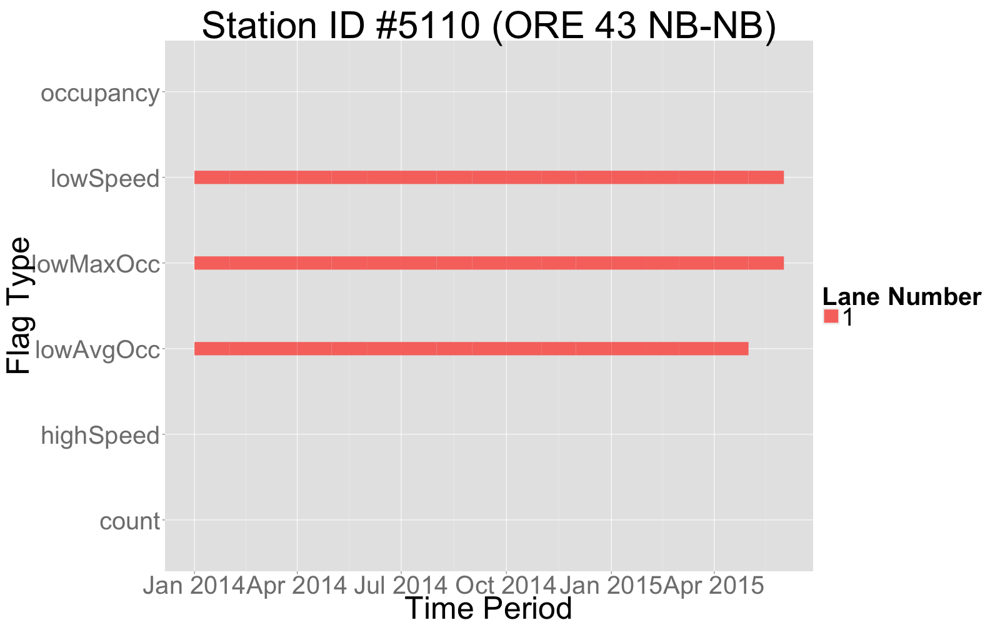

```{r,echo=FALSE}
stationReport = readRDS("data.RDS")
sid = stationReport$stationid
detectors = read.csv("detectors.csv")
```
---
title: "`r paste0('Station #',sid)`"
author: "Bryan Blanc"
date: "`r as.character(format(as.Date(Sys.time()),format='%B %d, %Y'))`"
geometry: margin=1in
output: html_document
---

This is a summary of the times, lane numbers, and flag types that have have been flagged for supsect values at this PORTAL station. This document is dynamic and can be regenerated. 



#Data Quality Flags

```{r,results='asis',echo = FALSE}
library(pander)
timeList = stationReport$times
if(length(timeList)>0){
    for(j in 1:length(timeList)){
    time = timeList[[j]]
    detList = time$detectors
    for (k in 1:length(detList)){
      detector = detList[[k]]
      if(is.list(detector)){
        if(sum(detector$flags)>0){
          if(k==1){
            cat("* Outage Period:",time$period,"\n")
          }
          cat("\t* Dectector: ",detector$detectorid," (Lane #",detectors$lanenumber[detectors$detectorid==detector$detectorid],")","\n")
          cat("\t\t* Flags:",paste(names(detector$flags[detector$flags==TRUE]),collapse = ", "),"\n")
        }
        
      }
      
    }
    
    
    }
}  

```
