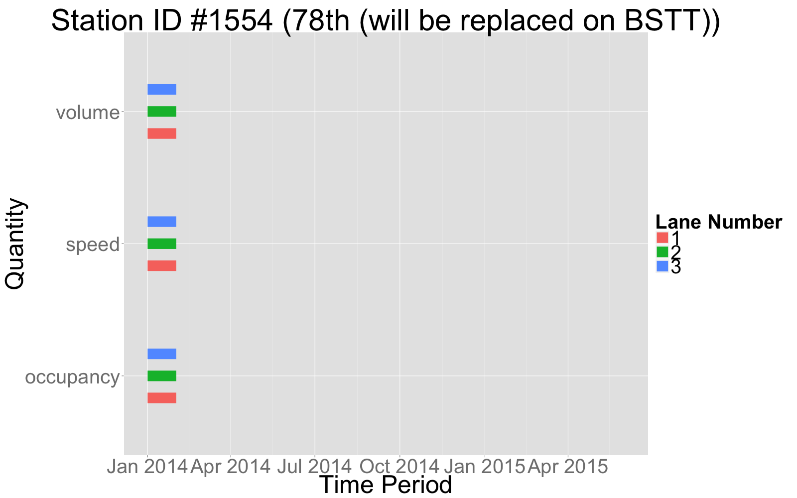

```{r,echo=FALSE}
stationReport = readRDS("data.RDS")
sid = stationReport$Station_ID
```
---
title: "`r paste0('Station #',sid)`"
author: "Bryan Blanc"
date: "`r as.character(format(as.Date(Sys.time()),format='%B %d, %Y'))`"
geometry: margin=1in
output: html_document
---

This is a summary of the times, lane numbers, and quantities that have missing data for this PORTAL station. This document is dynamic and can be regenerated. 



#Data Outages

```{r,results='asis',echo = FALSE}
library(pander)
outages = stationReport$outages
if(length(outages)>0){
    for(j in 1:length(outages)){
    outage = outages[[j]]
    
    cat("* Outage Period:",outage$timePeriod,"\n")
    hours = outage$hours
    if(!("ALL" %in% hours)){
      bins = hours[1]
      for (k in 2:length(hours)){
        if((hours[k]-hours[k-1])>1){
          bins = c(bins,hours[k])
        }
      }
      if(length(bins) %% 2 >0){
        bins=c(bins,hours[length(hours)])
      }
      ranges = vector()
      for(k in seq(1,length(bins),by=2)){
        ranges = c(ranges,paste0(bins[k],"-",bins[k+1]))
      }
      cat("\t* Hours:", paste(ranges,collapse=","),"\n")
    }else{
      cat("\t* Hours: ","0-24","\n")
    }
    
    
    cat("\t* Lanes:",paste(outage$lanes,collapse=","),"\n")
    cat("\t* Quantities:",paste(outage$quants,collapse = ", "),"\n")
    
    }
}  

```
